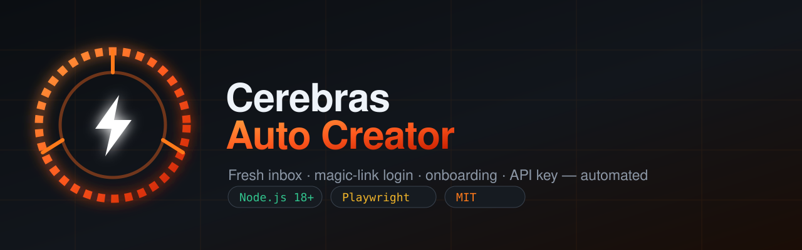

<div align="center">



# Cerebras Auto Creator

**Otomasi end-to-end untuk membuat akun Cerebras Cloud dan menghasilkan API key.**

Inbox sementara baru → login magic-link → onboarding → API key. Dibuat dengan Node.js + Playwright untuk VPS Ubuntu headless.

[](../LICENSE)
[](https://nodejs.org)
[](https://playwright.dev)
[](https://ubuntu.com)

[English](../README.md) · [Bahasa Indonesia](README.id.md) · [Español](README.es.md) · [中文](README.zh.md) · [日本語](README.ja.md)

</div>

---

## ✨ Fitur

- 📬 **Inbox sementara baru** — membuat mailbox sekali pakai di `tempmail.cloud`, tanpa registrasi.
- 🔗 **Login magic-link** — membaca email masuk, mengambil tautannya, dan login otomatis.
- 🧑 **Identitas acak** — menghasilkan nama lengkap dan perusahaan acak untuk onboarding.
- 🔑 **Nama API key acak** — membuat key dengan nama unik yang digenerate.
- 📦 **Mode batch** — buat N akun dalam sekali jalan dan ekspor CSV gabungan.
- 🖥️ **Siap VPS** — berjalan headless di Ubuntu biasa; tanpa desktop.

## ⚠️ Satu penghalang utama

Cerebras membatasi **setiap** API key di balik metode pembayaran yang tersimpan.
Tombol `GENERATE API KEY` membuka **form kartu Stripe**, bukan dialog nama key.
Mutasi GraphQL `CreateOrganizationApiKey` tidak dapat diakses sampai ada kartu di org.

Script ini melakukan **semua langkah akun secara otomatis**, lalu:

| Status | Arti |
|---|---|
| `success` | Key berhasil dibuat (hanya jika sudah ada kartu di org). |
| `account_created_key_blocked` | Akun dibuat dan login — Cerebras butuh kartu sebelum key bisa dibuat. |

Untuk mendapatkan key nyata, isi metode pembayaran sekali per akun. Set
`CARD_NUMBER`, `CARD_EXP`, `CARD_CVC`, `CARD_ZIP` di `.env` dan script akan mengisi
form Stripe. Gunakan hanya kartu yang Anda berhak gunakan.

## 🚀 Mulai cepat

```bash
git clone https://github.com/0xgetz/cerebras-auto-creator.git
cd cerebras-auto-creator
npm install

node src/create.mjs              # satu akun
ACCOUNTS=5 node src/batch.mjs    # lima akun + CSV
HEADLESS=false node src/create.mjs   # lihat browsernya
```

### Kebutuhan

- Ubuntu 20.04+ / Debian 12+
- Node.js 18+
- ~500 MB disk untuk Chromium

```bash
sudo apt-get update && sudo apt-get install -y nodejs npm
npm install
npx playwright install --with-deps chromium
```

## ⚙️ Konfigurasi

| Variabel | Default | Deskripsi |
|---|---|---|
| `HEADLESS` | `true` | `false` untuk melihat browser. |
| `OUT_DIR` | `outputs` | Lokasi hasil JSON/CSV. |
| `MAIL_TIMEOUT_MS` | `180000` | Waktu tunggu email masuk. |
| `CEREBRAS_FULL_NAME` | acak | Ganti nama yang digenerate. |
| `CEREBRAS_COMPANY` | acak | Ganti perusahaan yang digenerate. |
| `CEREBRAS_KEY_NAME` | acak | Ganti nama key yang digenerate. |
| `CARD_*` | kosong | Isi form Stripe (kartu yang sah saja). |

## 📤 Output

`outputs/cerebras-account-<timestamp>.json` — berisi email, password inbox, nama,
perusahaan, nama key, API key, dan status. Mode batch juga menulis
`outputs/cerebras-accounts.csv`.

## ⚖️ Legal

Proyek ini untuk **tujuan edukasi dan riset**. Otomasi pembuatan akun dapat
melanggar Ketentuan Layanan Cerebras. Anda bertanggung jawab penuh atas
penggunaannya. Jangan gunakan untuk penyalahgunaan, spam, atau penipuan.

## 📄 Lisensi

[MIT](../LICENSE) © 0xgetz
